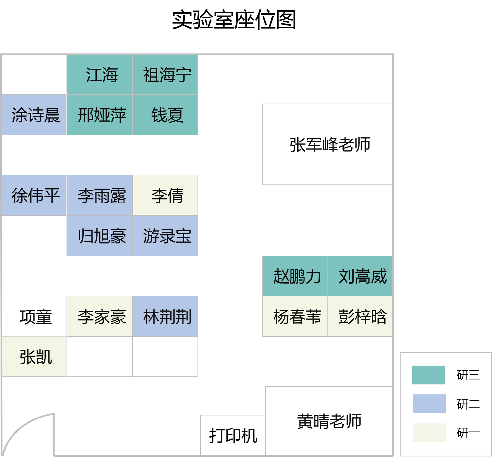

## 实验室座位图

## 实验室楼层示意图

## 物品准备参考

[物品准备](./doc/things-list.docx)

## 实验室作息表
|-|-|
|:-:|:-|
|早晨|8：30 - 11：30|
|下午|2：30 - 5：30|
|晚上|7：00  -9：00|

## 实验室值日表

[值日表](./doc/1.pdf)

------
地址：江苏省南京市江宁区将军大道29号南京航空航天大学 民航/飞行学院 
邮编：211106

